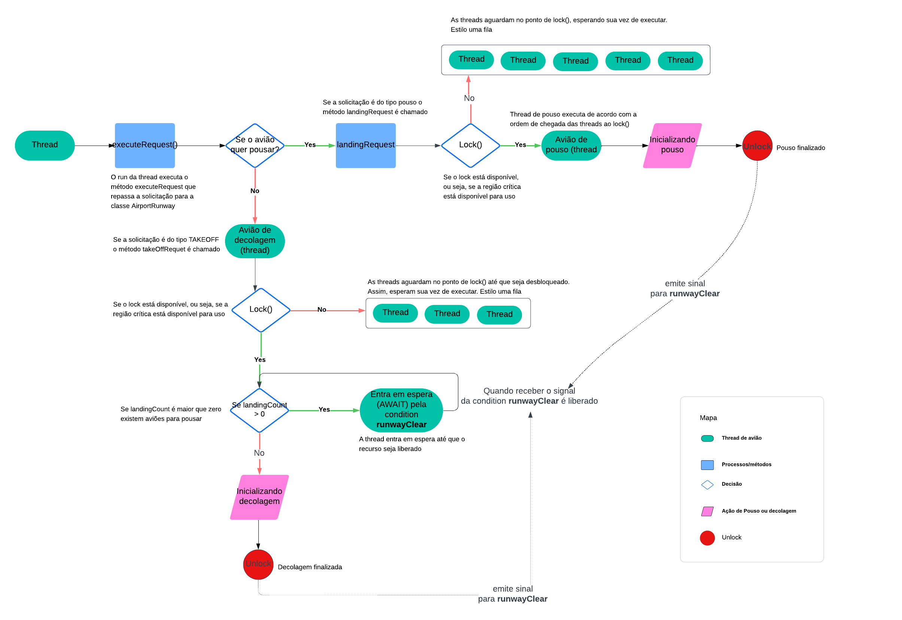

# Trabalho Prático: Um sistema de gestão de pista de aeroporto

Última atualização: 15/01/2025

## Introdução

O presente trabalho tem como objetivo implementar uma solução para simular um **sistema de pista de aeroporto** utilizando programação concorrente. Levando em consideração que existe apenas uma pista e múltiplos aviões querendo utilizá-la, além disso, apenas um avião pode fazer a utilização da pista por vez. O intuito principal deste trabalho é aplicar mecanismos de sincronização para controlar o uso do recurso compartilhado, neste cenário, a pista de aeroporto. Além de realizar o controle de exclusão mútua, deadlock e starvation. 

    
Inicialmente entendemos o cenário dado para buscar um mecanismo de sincronização. Partimos do princípio em que um **avião é uma thread** e que a **pista do aeroporto é um recurso compartilhado** entre os aviões. Além de que deveríamos considerar que o **pouso tem preferência em relação à decolagem**, sendo assim, associamos isso a uma variável de condição sobre o status da pista está livre ou não, entretanto, também deveríamos bloquear aquele recurso compartilhado que estava em uso para garantir a consistência dos dados, logo, os demais aviões ficassem aguardando sua vez. 
    

A partir disso, aplicamos o conceito de **Monitores e variáveis de condições**. Ao analisar a biblioteca do Java identificamos a disponibilidade do mecanismo de sincronização **Lock e Condition**. Sendo assim, demos continuidade na implementação, utilizando um lock para fazer o bloqueio e o desbloqueio da região crítica, assim permitindo que apenas uma thread execute por vez garantindo a exclusão mútua e evitando a condição de corrida.
    

Além disso, adicionamos um **condition associado ao conceito da pista estar livre**, pois apenas o bloqueio e desbloqueio não seria suficiente para garantir a preferência do pouso em relação a decolagem, pois ambos tipos de solicitações iriam disputar o recurso e ganhava quem chegasse primeiro. Para isso, fizemos o uso de uma **variável atômic**a para fazer a **contagem de solicitações do tipo pouso** e verificar se ainda existiam threads de avião para realizar pouso esperando para serem executadas.

## Estrutura

**Descrição:** Imagem que ilustra a estrutura do projeto, onde mostra os fluxos desde a chegada das threads até sua execução. Passando pelas etapas de processos ou chamadas ao métodos, condicionais, ações e finalizações.  
**Fonte:** Autoria própria

A partir deste diagrama, temos que a simulação se inicia quando uma thread executa o método <code>executeRequest()</code> que vai avaliar se a solicitação é para pouso ou decolagem. No caso das operações de pouso, o sistema usa o mecanismo <code>lock()</code> para controlar o acesso a região crítica, permitindo que apenas um thread execute por vez naquele trecho de código. Assim as demais threads chegam e ficam paradas no lock até que seja liberado. Nos momentos em que a pista estiver ocupada, a thread (avião) entra em uma fila de espera. Caso contrário, a thread da início ao processo de pouso respeitando a ordem de chegada. Em caso de decolagem, o sistema também analisa a disponibilidade por meio do mecanismo <code>lock()</code>. Contudo, nesse caso o sistema verifica o landingCount (quantidade de aeronaves aguardando pouso) - se houver aeronaves esperando para pousar, a thread de decolagem entra em estado AWAIT até que o recurso seja liberado. É utilizado <code>condition</code> para verificar a disponibilidade da pista.

O sistema conta com um mecanismo de sincronização para priorizar operações de pouso sobre decolagens. Cada operação é finalizada adequadamente após sua conclusão, liberando o recurso para a próxima thread em espera.

## Authors
- [Breno Barbosa](https://github.com/Brevex)  
- [Vanessa Maria](https://github.com/Vanessa-Maria2)   